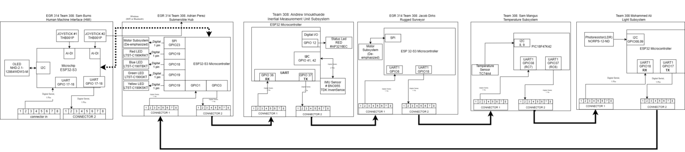
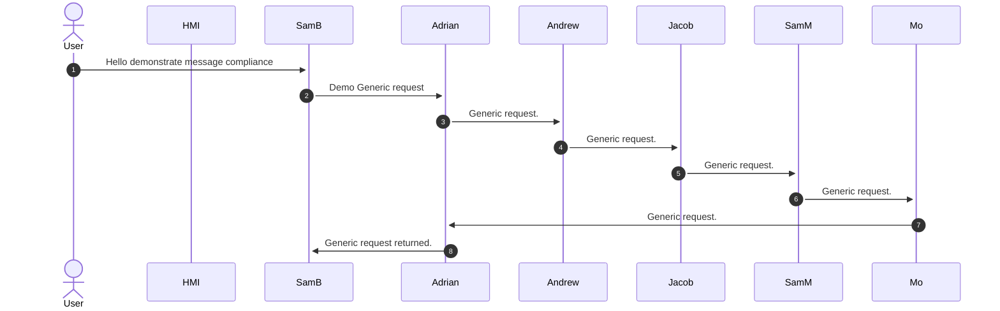
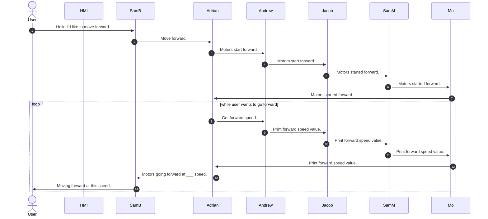
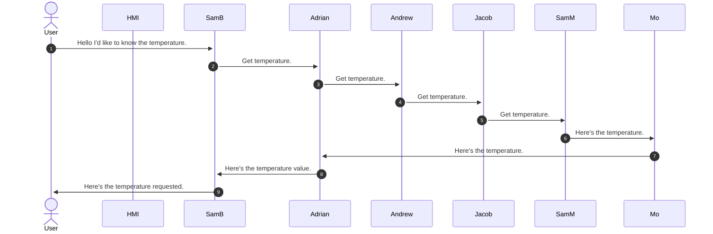
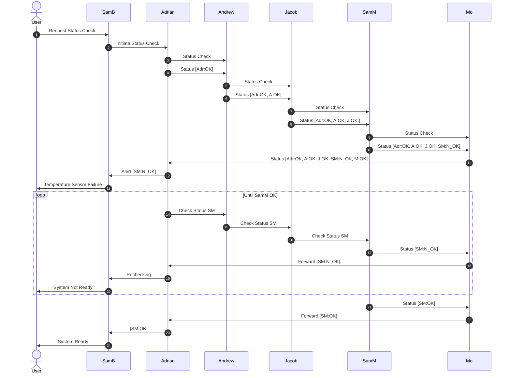
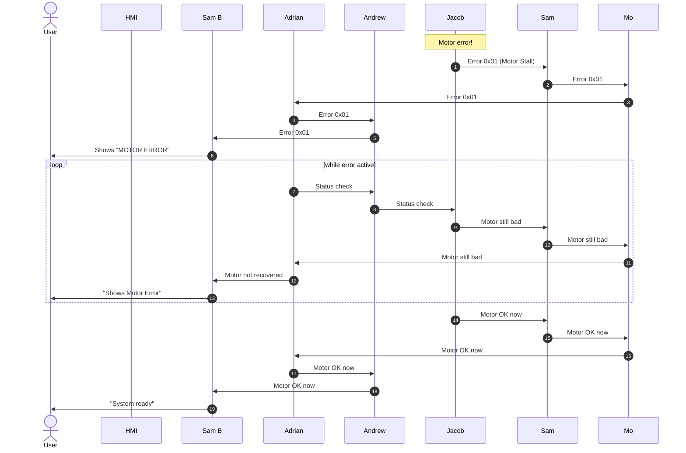
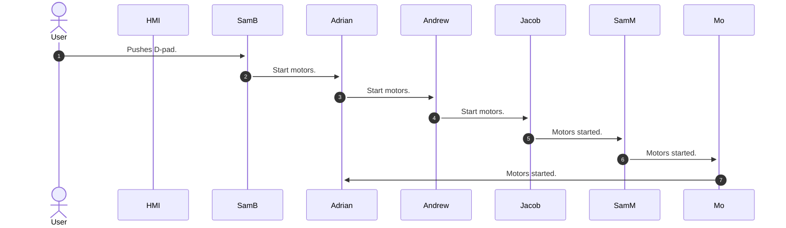
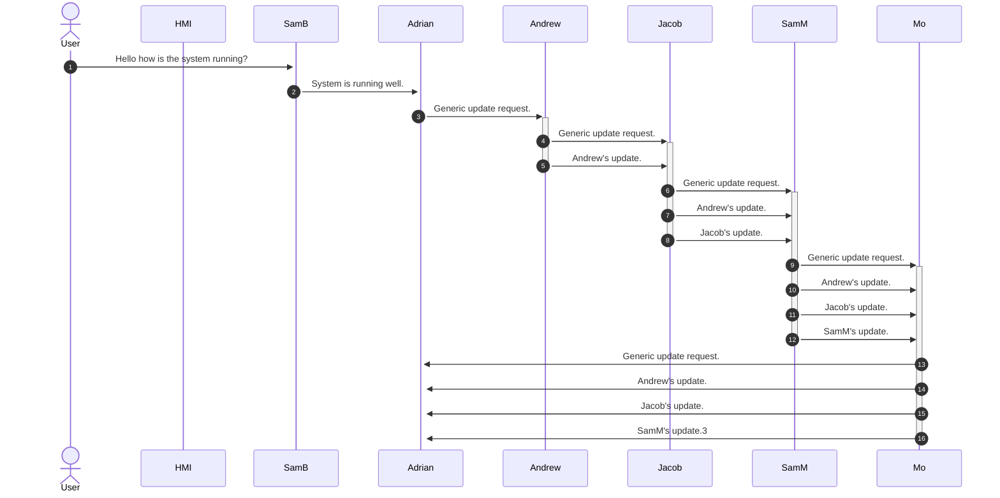

## **1. Team Block Diagram**

Below is a Block Diagram of our project. In this figure, we will show how we intend to connect our individual subsystems to build our project. We plan to mainly communicate via UART. However, our HMI and Controller systems also have a wireless communication protocol.

A PDF version of the block diagram can be found [here](TeamBlockDiagram.pdf)

## **2. Sequence Diagram of Team Communication**

### **Generic pattern for message communication**

Since there's an unspecified user this message will be retransmitted by each subsystem.

This diagram will demonstrate how our communication will travel through our system for each message type.

### **Motor set parameter and print value:**

### **Return a sensor value:**

### **Subsystem Status Check Code/Message:**

### **Subsystem Error Code/Message:**

### **Subsystem State Change:**

## **Message Structure for Elimination:**

### **Communication Sequence Diagram Discussion**

- The functionality shown in the communication sequence diagram satisfies user needs and product requirements by showing how the submarine system collects, shares, and reacts to information across multiple subsystems. A user would expect the submarine to operate as one complete system rather than as separate boards, and our communication sequence supports that by defining how messages move between subsystems in a clear and reliable way. This helps ensure that sensor data, control requests, and subsystem responses are all exchanged in an organized format.
- Another requirement is that the submarine must collect and share environmental data. Our sequence diagram supports this by showing how sensor subsystems send information like light and temperature to the control subsystem. This allows the submarine to react based on real sensor input.
- Another important requirement is making sure packets are valid. The sequence diagram supports this by using start and end bytes, which helps the boards recognize correct packets and avoid mistakes from bad data.
- Our communication sequence diagram explains how the subsystems communicate with the HMI and how the HMI sends information back through the system. This is important because the HMI acts like the main user interface for the submarine Project. It allows the system to collect information from different subsystems, display useful date, and send commands or updates back when needed.
- Overall, our communication sequence diagram satisfies user needs because it allows the HMI to receive useful subsystem information and send requests or commands back into the system. It satisfies product requirements by showing structured communication, packet forwarding, subsystem responses, and reliable message handling across the full submarine project.

## **3. Message Types**

We will mainly be utilizing UART communication.

| **Message Num** | **Byte 1-2(Characters)** | **Byte 3 (uint8_t)** | **Byte 4 (uint8_t)** | **Byte 5 (uint8_t)**  | **Byte 6 (uint8_t)**  | **Byte 7 (uint8_t)**  |  **Byte 8 (uint8_t)**   |  **Byte 9 (uint8_t)** | **Byte 10 (uint8_t)** | **Byte 11-12 (Characters)** | **Purpose** |
| :--------------:| :--------------------: | :------------------: | :------------------: | :------------------: | :------------------: | :------------------: | :------------------: | :------------------: | :------------------: | :------------------: | :------------------: | 
|        1        | 'AZ' | Sender Subsystem Number | Receiver Subsystem Number   |  0x01      |   Desired Subsystem Number  | Motor Number | Upper Motor Speed |  Lower Motor Speed | Motor Direction | 'BY' | Set motor speed parameter |
|        2        | 'AZ' | Sender Subsystem Number | Receiver Subsystem Number |  0x02     |   Desired Subsystem Number  | Motor Number  |  Upper Motor Speed |  Lower Motor Speed | Motor Direction | 'BY' | Print motor speed |
|        3        | 'AZ' |  Sender Subsystem Number |  Receiver subsystem Number|    0x03           |   Desired Subsystem Number  | Sensor Number        | Upper Sensor Number          | Lower Sensor Number          |          | 'BY'            | Print Sensor Value |
|        10       | 'AZ' |  Sender Subsystem Number |  Receiver Subsystem Number|    0x0A           |   Desired Subsystem number  | Upper Number         | Lower Number          |           |          | 'BY'           | Subsystem error code |
|        12       | 'AZ' |  Sender Subsystem Number | Receiver Subsystem Number|     0x0C           |   Desired Subsystem number  | Upper Number         | Lower Number          |           |           | 'BY'            | Subsystem status code |
|        13       | 'AZ' |  Sender Subsystem Number | Receiver Subsystem Number|     0x0D           |   Desired Subsystem Number  |          |           |           |          | 'BY'            | Subsystem status message |
|        14       | 'AZ' | Sender Subsystem Number |  Receiver Subsystem Number|     0x0E           |   Desired Subsystem Number  | Sending Subsystem Number | Upper Number         | Lower Number          |           | 'BY'            | Subsystem error code response |
|        15       |  'AZ' |  Sender Subsystem Number |  Receiver Subsystem Number|   0x0F           |   Desired Subsystem Number  | Sending Subsystem Number | Upper Number         | Lower Number          |          | 'BY'            | Subsystem status code response |
|        67       |  'AZ' | Sender Subsystem Number | Receiver Subsystem Number|     0x43           |   Desired Subsystem Number  | Button # (uint8_t)   |         |           |           | 'BY'          | Button x pushed |

<!-- upper and lower number are due to byte range, -->

For the current design, the team has one pcb off the shared line and outside of the circle for UART communication and has them acting as the Human Machine Interface. This means that they'll need to receive redirected messages from the submarine. This means on several messages we'll have to include a desired subsystem number so the message can be correctly redirected or updated on who the original sender was. This is because Bytes 3 and 4 will get updated if the message isn't just copied over to the new channel for the HMI or for the team based on the original sender at the wireless connection point. After that we knew we would have to have several messages regarding status requests as well as responses. Therefore, in order to ensure that messages were consistent and additional bytes weren't being sent the team decided to use codes rather than extra string spaces. This allows for faster communication and a lower likelihood of losing data. Finally, the motor includes a speed parameter in case the team needed to switch away from spi control and route it through pwm but also because the servo motors include pwm and could be told to go slow as they were tilting. This would accommodate the 360 degree functionality of the joysticks and potentially offer more control for the user. All of this to say that the team in general just went for messages that would allow communication of finer details in a standardized package and allow the user more functional control.

## **Challenges**

1. Reduced the amount of message types needed for UART communication.
   Originally the team had extra messages that had the same action and would prevent ease of functionality. The easiest way to solve this duplicate data scenario was to vote on which type we wanted to conform to and remove the rest from our code.
2. Changed from full hex to include ASCII header/footer.
    Team members were expecting different types of headers and it wasn't parsing consistently across the 6 different boards. Our solution was to mitigate the chance someone was expecting something different and assign the encoding /decoding to a set standard and keep the message bodies in hexadecimal form. This allowed for quick checks on how we were getting the messages and how to send them to other boards with ease. It also helped significantly in debugging.
3. Implemented a redirection functionality instead of a rewrite functionality for HMI to submarine.
    The ESP-NOW Protocol only activates when messages are sent to 1 and or sent to 2 from 1. That way we can ensure clean message protocol over both esp now and UART. We did this to meet our wifi communication requirement, we also did it as a way to avoid any network delays through MQTT especially for showcase, we did not want to get tangled up with the other networks.
4. The IMU message format changed to compensate for the additional data compared to the other sensors.
    The IMU doesn't simply send a two digit packet like we had built for the other sensors, it's currently set up to send 3 different sets of data all in one packet. This made it easy on UART so simply adjusting how the HMI was handling that message was an easier fix then sending 3 additional messages. UART protocol between HMI and Submarine to reroute HMI messages out of UART chain. The HMI used to be part of the UART daisy chain before being removed and set as a wifi destination.
5. Sensor were adjusted to send every few seconds to keep the sensor data update in real time.
    The main issue we were fighting was that we would lose data if a system got two different messages at the same time during the request ping. In order to prevent this loss of data from being a cascading issue, we had the sensor boards send updates every few seconds. This meant that if one wasn't overwritten right away then the update would likely happen on the next iteration. Allowing for more consistent data and a backup to get that data in case transmission speeds were different or packets got dropped.
