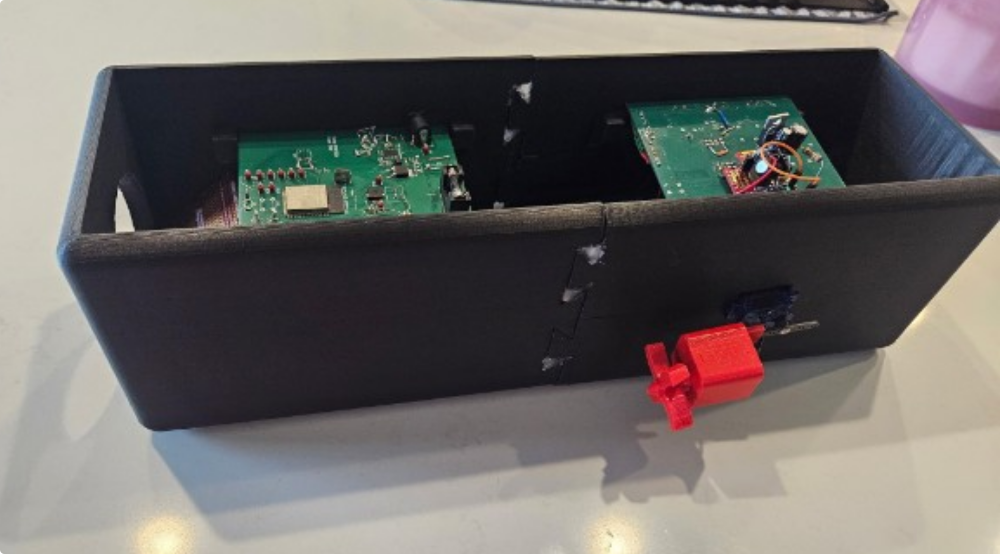
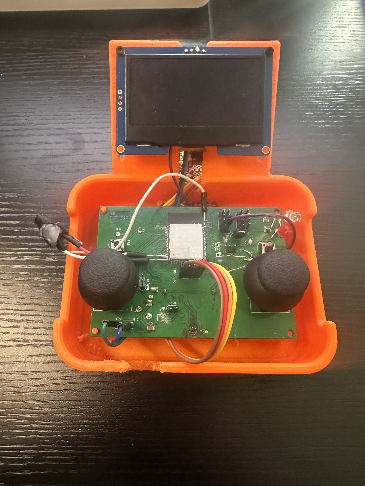

## **Showcase Poster**

Figure 1: Rendition of our poster which is also available as a ["pdf here."](Team308_ProjectPoster.pdf)

## **Final Images**

Figure 2: Side view of the final design to complement home page's view.

Figure 3: Top view of the controller design for this project.

<iframe width="560" height="315" src="https://www.youtube.com/embed/qLsyMYMwPKg?si=9JHVz6zkyMh8drUT" title="YouTube video player" frameborder="0" allow="accelerometer; autoplay; clipboard-write; encrypted-media; gyroscope; picture-in-picture; web-share" referrerpolicy="strict-origin-when-cross-origin" allowfullscreen></iframe>

Video 1: Display of the HMI working with the sub offscreen.

Also the files needed to print these 3D modeled elements are available ["as a zip folder here"](3dPartsSubmarine.zip)
